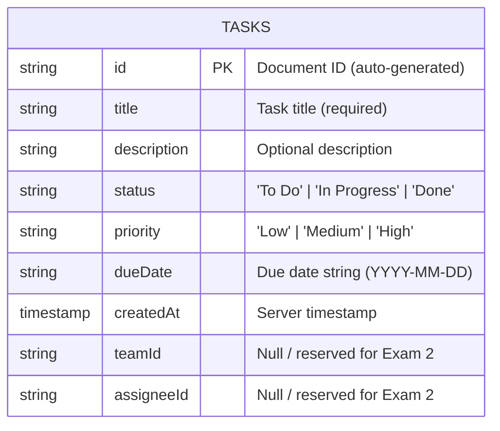

# 📱 TaskPulse - Task Management Mobile App (Practical Exam 1)

A modern, responsive Task Management mobile application built with **React Native (Expo)**, **TypeScript**, and connected to **Google Cloud Firestore (Firebase)** for real-time CRUD operations.

---

## 🎯 Project Objectives & Overview
- **Framework**: React Native with Expo SDK 57 (TypeScript)
- **Database / Backend**: Google Cloud Firestore (Firebase v10+)
- **Navigation**: React Navigation (Bottom Tabs)
- **State & Sync**: Real-time Firestore synchronization (`onSnapshot`)
- **Version Control**: Git & GitHub with structured commit history

---

## 🏗️ Architecture & Folder Structure
```text
Ass1_MMA/
├── src/
│   ├── components/            # Reusable UI components
│   │   ├── TaskCard.tsx       # Individual task display card
│   │   └── TaskModal.tsx      # Create & Edit Task modal form
│   ├── navigation/            # App navigation configurations
│   │   └── AppNavigator.tsx   # Bottom Tab Navigator
│   ├── screens/               # Application screens
│   │   ├── HomeScreen.tsx     # Main CRUD screen with real-time tasks
│   │   ├── TeamsScreen.tsx    # Placeholder for Exam 2
│   │   └── ProfileScreen.tsx  # Placeholder for Exam 2
│   ├── services/              # External service integrations
│   │   ├── firebase.ts        # Firebase app & Firestore initialization
│   │   ├── firebaseConfig.example.ts
│   │   └── taskService.ts     # Firestore CRUD operations & listeners
│   └── types/                 # TypeScript interfaces and types
│       └── task.ts            # Task data model
├── .env.example               # Environment variables template
├── .prettierrc                # Code styling configuration
├── App.tsx                    # Root component
├── app.json                   # Expo configuration
├── package.json
└── tsconfig.json
```

---

## 📊 Firestore Data Model (ERD)

### Tasks Collection Schema (`tasks`)



### Field Definitions:
| Field | Type | Description |
|---|---|---|
| `id` | `string` | Auto-generated Firestore Document ID |
| `title` | `string` | Task title (Required, validated client-side) |
| `description` | `string` | Optional details or notes |
| `status` | `string` | Task status: `To Do` \| `In Progress` \| `Done` |
| `priority` | `string` | Priority level: `Low` \| `Medium` \| `High` |
| `dueDate` | `string` | Formatted due date (`YYYY-MM-DD`) |
| `createdAt` | `timestamp` | Server timestamp for ordering |
| `teamId` | `string \| null` | Reserved for Practical Exam 2 |
| `assigneeId` | `string \| null` | Reserved for Practical Exam 2 |

---

## 🚀 Getting Started

### 1. Prerequisites
- Node.js (v18+)
- npm or bun
- Expo Go on Android / iOS device OR Android Studio / Xcode Simulator

### 2. Installation
```bash
# Clone the repository
git clone https://github.com/ThanhNam7791aaa/Ass1_MMA.git
cd Ass1_MMA

# Install dependencies
npm install
```

### 3. Firebase Configuration
Create a `.env` file in the root directory (based on `.env.example`):
```env
EXPO_PUBLIC_FIREBASE_API_KEY=your_api_key
EXPO_PUBLIC_FIREBASE_AUTH_DOMAIN=your_project.firebaseapp.com
EXPO_PUBLIC_FIREBASE_PROJECT_ID=your_project_id
EXPO_PUBLIC_FIREBASE_STORAGE_BUCKET=your_project.appspot.com
EXPO_PUBLIC_FIREBASE_MESSAGING_SENDER_ID=your_sender_id
EXPO_PUBLIC_FIREBASE_APP_ID=your_app_id
```

### 4. Running the App
```bash
# Start Expo development server
npx expo start
```
- Press `a` for Android Emulator
- Press `i` for iOS Simulator
- Scan the QR code using the **Expo Go** app on your phone

---

## ✨ Features Implemented
- [x] **Full CRUD operations**: Create, Read, Update, and Delete tasks directly with Firestore.
- [x] **Real-time Listener**: Instant UI updates via Firestore `onSnapshot`.
- [x] **Navigation**: Bottom Tab navigation with Tasks, Teams (Coming Soon), and Profile (Coming Soon).
- [x] **Bonus - Status Filtering**: Filter tasks by `All`, `To Do`, `In Progress`, `Done` with dynamic count badges.
- [x] **Bonus - Client-side Validation**: Mandatory title check before saving with inline error alerts.
- [x] **Bonus - Pull-to-Refresh**: Smooth pull down on the list to refresh.
- [x] **Bonus - Responsive & Modern UI**: Card layout, custom status & priority pills, clean modal.
